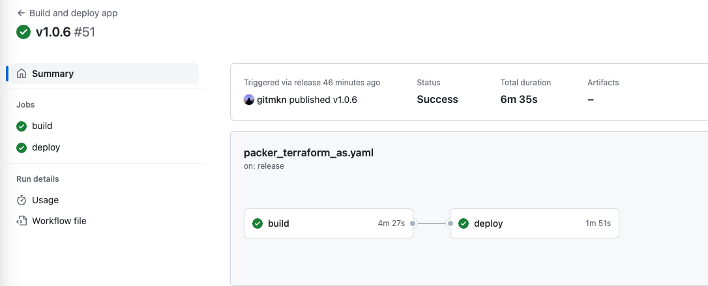

<div>
  <p>
    <a href="https://cloud.tencent.com">
        
    </a>
    <br>
    <i></i>
    <br>
  </p>
</div>


# packer + terraform + as实践

#### 示例使用Packer + Terraform结合Tencentcloud AS实现业务弹性伸缩, 结合github action实现CI/CD。
#### 示例仅供参考。

# 场景描述
#### 1、部署2048小游戏在云服务器上
#### 2、可多地域复制
#### 3、可根据负载弹性伸缩

# 目录结构
```
├── packer                  # packer build配置文件
│   └── packer_tencentcloud_cvm_jenkins_1.0.json
├── business                # 业务应用代码
│   ├── 2048.css
│   ├── index.html
│   ├── jquery.min.js
│   ├── main.js
│   ├── showanimation.js
│   └── support.js
├── terraform               # 实现业务部署
│   └── as
│       ├── main.tf         # vpc、clb、as
│       ├── provider.tf
│       └── variables.tf
├── go.mod
└── README.md
```
# 结果展示
### github action运行结果


### 应用部署结果


---
<small>业务应用代码来源：https://github.com/bodhiye/2048</small> 